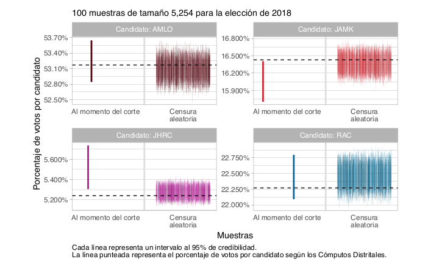

```{r setup, include=FALSE}
knitr::opts_chunk$set(echo = TRUE)
```


```{r setup2, include=FALSE, message = FALSE}
library(tidyverse)
knitr::opts_chunk$set(echo = TRUE)
theme_set(theme_minimal(base_size = 13))
knitr::opts_chunk$set(echo = TRUE)
# paquetes y codigo 
library(patchwork)
library(survival)
library(survminer)
library(DT)

estados <- c("ZAC", "COL", "CHIH", "MICH", "NAY", "BC", "BCS", "SON",
             "SIN", "NL", "SLP", "QRO", "GRO", "TLAX", "CAMP")
source("./simulacion_tiempos.R")
source("./lectura_procesamiento.R")
```

En este documento analizamos cómo incide el patrón de censura
por tiempo de llegada de la información de casillas en las estimaciones en 
las elecciones de 2018.  Utilizamos modelos de supervivencia para modelar tiempos de llegada
dependiendo de características de casillas, secciones y entidades correspondientes.

Este ejercicio tiene dos objetivos principales:

- Producir muestras (bajo un esquema de muestreo arbitrario) 
con tiempos de llegada para cada casilla. Estas muestras se utilizan para evaluar
**diseño muestral y métodos de estimación**, considerando tiempos de corte en los que la muestra 
está todavía parcialmente **censurada**.

- Producir reglas o diagnósticos en términos de las propiedades de los estimadores para
tomar decisiones acerca de horas de salida de la información dependiendo de la muestra
observada.


## Efectos de la censura en 2018


En [@TesisGO] se consideran dos puntos importantes para lo que sigue:

- Aunque existe diferencia entre datos recibidos durante el proceso del Conteo Rápido y los 
Cómputos Distritales, la diferencia es pequeña y no cambia mucho ninguna de las estimaciones
producidas. 
- La muestra censurada al tiempo de salida **no** puede considerarse como una submuestra
aleatoria de la muestra seleccionada.

Para hacer una comparación clara, en [@TesisGO]: 

- Se construyeron intervalos (bajo
el método bayesiano que se considera en esta tesis) para la muestra observada (tamaño $n_{obs}$) 
hasta la hora de salida, utilizando los cómputos distritales. 
- Además, se produjeron 100 submuestras aleatorias de la muestra seleccionada de tamaño $n_{obs}$, y
se construyeron intervalos correspondientes.

El resultado se muestra en esta gráfica:



#### Conclusión 1

El proceso generador de datos de la muestra observada no puede considerarse
como una submuestra aleatoria de la muestra seleccionada. En algunos casos, la diferencia
de localización (que se puede cuantificar como sesgo) entre los intervalos 
es comparable o más grande que el ancho de los intervalos producidos. El
efecto se observó en todos los candidatos, quizá excluyendo a RAC.


## Modelos para tiempo de llegada de información de casillas

Considerando lo anterior, buscamos construir modelos para los tiempos de llegada
que capturen el sesgo observado en el ejercicio anterior. 

Usamos modelos paramétricos de supervivencia (*survreg*) para los tiempos de
llegada de las casillas, con las casillas obtenidas al corte de media noche. 
Estos modelos son estratificados por estado, y usamos
tiempos de llegada log-logísticos.

#### Datos

Muestra seleccionada por COTECORA y muestra observada al corte de las 00:00 del
día siguiente a la elección. Solo consideramos los estados con elección en 2021.

#### Variables

Modelamos el tiempo de llegada observado, con censura por la derecha para las
casillas que no llegaron antes del las 00:00 horas. Las covariables utilizadas en el modelo
son:

- Estado, tipo de sección, tipo de casilla y tamaño de la lista nominal por casilla (INE, Cómputos distritales 2018)
- La primera componente principal de variables de equipamiento y servicios de las viviendas  (INEGI, Estadísticas
censales a escalas electorales, 2010)
- Porcentaje de votos obtenidos para AMLO, JAMK y RAC (INE, Cómputos distritales 2018)


```{r, echo = FALSE, cache=FALSE}
llegadas_tbl_2 <- llegadas_tbl %>% 
  filter(state_abbr %in% estados) %>%
  ungroup %>% 
  mutate(tiempo_huso = ifelse(tiempo - huso > 0, 
                              tiempo - huso, 0.001)) %>% 
  mutate(ln_log_c = lista_nominal_log - mean(lista_nominal_log)) 
formula <- as.formula("Surv(tiempo_huso, status) ~ 1 +
      state_abbr:ln_log_c +
      ln_log_c:tipo_casilla +
      state_abbr:I(tipo_seccion == 1) +
      tipo_casilla + 
      state_abbr:.fittedPC1 +
      state_abbr:log((1+RAC_1)/(TOTAL_VOTOS_CALCULADOS + 1)) + 
      state_abbr:log((1+AMLO_1)/(TOTAL_VOTOS_CALCULADOS + 1)) +
      state_abbr:log((1+JAMK_1)/(TOTAL_VOTOS_CALCULADOS +  1)) +
      strata(state_abbr)")
reg_2 <- survreg(formula, 
    llegadas_tbl_2, 
    dist='loglogistic', x = TRUE,
    control = survreg.control(maxiter = 50000))
```


Simulando del modelo construido podemos checar el ajuste a total para cada estado. Las líneas
grises muestran 50 simulaciones del modelo y la roja los datos observados:

```{r, cache = TRUE , echo = FALSE, fig.width=6, fig.height=6}
set.seed(188324)
datos_sim <- map(1:50, ~ simular_cuantiles(.x, llegadas_tbl_2, reg = reg_2)) 
gg_obs <- ggsurvplot(survfit(Surv(tiempo_huso, status)~ state_abbr, llegadas_tbl_2))
datos_obs <- gg_obs$data.survplot %>% mutate(id = 71)
datos_check <- bind_rows(datos_obs, datos_sim) %>% 
  mutate(strata = str_sub(strata, 12, 30))
ggplot(datos_check %>% filter(id!=71), aes(x = time, y = surv, group = id)) +
  geom_hline(yintercept = 0.50, colour = "gray") +
  geom_step( alpha = 0.3, colour = "gray") +
  geom_step(data = datos_check %>% filter(id==71), colour = "red") +
  facet_wrap(~ strata) + 
  ylab("% Censurado") + xlab("Horas después de hora de cierre de casillas")
```

Abajo consideramos los efectos marginales de algunas variables (gráficas de dependencia parcial, ver @friedman): 

```{r, echo = FALSE}
datos <- llegadas_tbl_2 %>%
  #filter(state_abbr!="BCS") %>% 
  group_by(state_abbr, tipo_seccion) %>% 
  mutate(n = n()) %>% 
  ungroup %>% 
  select(-.fittedPC1, -tipo_seccion) %>% 
  crossing(tibble(.fittedPC1 = 
                    quantile(llegadas_tbl_2$.fittedPC1, probs = seq(0.1, 0.9, 0.1)))) %>%
  crossing(tipo_seccion = c(1,2,3)) 
preds_50 <- predict(reg_2, newdata = datos, type = "quantile", p = 0.75)
datos <- datos %>% mutate(pred = preds_50) %>%
  group_by(.fittedPC1, tipo_seccion) %>% 
  summarise(pred_prom = mean(pred), n = min(n),.groups = "drop") %>% 
  ungroup() %>% 
  mutate(tipo_seccion = ifelse(tipo_seccion == 1 , "Urbana", "Rural-Mixta"))
g_1 <- ggplot(datos, aes(x = .fittedPC1, y = pred_prom, group = tipo_seccion, colour = tipo_seccion)) + geom_line() +
  xlab("Componente 1") + ylab("Promedio de cuantil 0.75 ") + geom_rug(sides="b") +
  ylim(3.5, 5.5)
```

```{r, echo = FALSE}
datos <- llegadas_tbl_2 %>%
  #filter(state_abbr!="BCS") %>% 
  select(-ln_log_c, -LISTA_NOMINAL, -tipo_seccion) %>% 
  crossing(tibble(ln_log_c = quantile(llegadas_tbl_2$ln_log_c, probs = seq(0.1, 0.9, 0.05)),
                  LISTA_NOMINAL = quantile(llegadas_tbl_2$LISTA_NOMINAL, probs = seq(0.1, 0.9, 0.05)))) %>% 
  crossing(tipo_seccion = c(1,2,3)) 
preds_50 <- predict(reg_2, newdata = datos, type = "quantile", p = 0.75)
datos <- datos %>% mutate(pred = preds_50) %>%
  group_by(LISTA_NOMINAL, tipo_seccion) %>% 
  summarise(pred_prom = mean(pred), .groups = "drop")%>%  
  mutate(tipo_seccion = ifelse(tipo_seccion == 1 , "Urbana", "Rural-Mixta"))
g_2 <- ggplot(datos, aes(x = LISTA_NOMINAL, y = pred_prom, group = tipo_seccion, colour = tipo_seccion)) + 
  geom_line() +
  geom_rug(sides = "b") +
   xlab("Lista Nominal") + ylab("")+
  ylim(3.5, 5.5)
```

```{r, fig.width = 6, fig.height=3, echo = FALSE}
g_1 + g_2 + plot_layout(guides = "collect") +
  plot_annotation(subtitle = "Efectos marginales (agregado sobre entidades)")
```

La asociación del tamaño de voto por cada candidato con el tiempo de llegada es también
improtante. Varía por estado y se pueden consultar los coeficientes del modelo
en el apéndice.

## Simulación, error cuadrático medio y censura

Considerando que los tiempos de llegada dependen de características de las casillas,
muestras censuradas por la hora de llegada pueden producir estimaciones sesgadas. En lo
que sigue compararemos el tamaño del sesgo con el error estándar para distintos tamaños
de muestra iniciales.

El proceso de simulación es como sigue:


1. Obtenemos por bootstrap paramétrico una simulación de parámetros para
el modelo ajustado de tiempos de llegada mostrado en la sección anterior (@Efron)
2. Seleccionamos una muestra estratificada proporcional por distrito de la tabla de cómputos distritales.
3. Simulamos tiempos de llegada para cada casilla de la muestra del inciso anterior
4. Censuramos la muestra a una hora de llegada fija.
5. Usamos el  **estimador de razón combinado** según el diseño de la
muestra para estimar la proporción de votos de cada candidato y el error estándar de
la estimación.
6. Calculamos error cuadrático medio y sesgo adicionalmente al error estándar.


#### Ejemplo: Chihuahua

Antes de producir estimaciones para todas las entidades seleccionadas, consideramos
el caso particular de Chihuahua. Usaremos 500 muestras en este ejemplo.


```{r, cache = TRUE, echo =FALSE, message=FALSE, warning=FALSE}
# cortes (horas después de 18:30 en la elección de 2018)
cortes <- c(1.5, 2.5, 3, 3.5, 4, 4.5, 5.5, Inf)
# tamaño de muestra
props_muestra <- c(0.03, 0.05, 0.10)
estado_sim <- "CHIH"
eval_tbls <- parallel::mclapply(props_muestra, function(x) {
    map_df(1:500, ~ simular_cortes(.x, cortes = cortes, prop_muestra = x, estado_sim = estado_sim))
  },  mc.cores = 3)
evals_tbl <- bind_rows(eval_tbls)
total <- seleccionar_muestra(conteo, prop = 1, estado_sim)
prop_obs_tbl <- total %>% 
  #filter(!is.na(TVIVHAB)) %>% 
  pivot_longer(cols = all_of(c("AMLO_1", "RAC_1", "JAMK_1")), 
               names_to = "candidato", values_to ="num_votos") %>% 
  group_by(candidato, state_abbr) %>% 
  summarise(acumulado_cand = sum(num_votos), 
            acumulado_tot = sum(TOTAL_VOTOS_CALCULADOS),
            .groups = "drop") %>% 
  mutate(prop_obs = acumulado_cand / acumulado_tot) %>% 
  select(state_abbr, candidato, prop_obs)
#prop_obs_tbl
ecm_tbl <- evals_tbl %>% 
  left_join(prop_obs_tbl) %>% 
  ungroup() %>% 
  group_by(corte, prop_muestra, candidato) %>% 
  summarise(sesgo = mean(prop_cand) - mean(prop_obs),
            varianza = var(prop_cand)) %>% 
  ungroup %>% 
  mutate(recm = sqrt(sesgo^2 + varianza)) %>% 
  mutate(prop_muestra = factor(prop_muestra))
ecm_tbl <- ecm_tbl %>% 
  mutate(corte_f = factor(corte))
```

En primer lugar, **el error cuadrático medio es menor si se selecciona una
muestra inicial más grande**, y se reduce conforme la hora de censura es más
tarde:

```{r, echo = FALSE, fig.height = 3, fig.width = 8}
ggplot(ecm_tbl, aes(x = corte, y = recm, 
                    colour = prop_muestra, 
                    group = prop_muestra)) +
  geom_vline(xintercept = 4, colour = "gray30") +
  geom_point() + geom_line() +
  ylab("Raíz de Error Cuadrático Medio") + 
  xlab("Hora de censura (horas después de cierre de casillas)") +
  facet_wrap(~candidato)
```

Sin embargo, la **proporción del error que se debe a sesgo es más grande cuanto
más grande sea la muestra inicial** (del lado derecho de cada gráfica se muestra
se muestra la estimación con muestra completa)

```{r, echo = FALSE, fig.height = 3, fig.width = 8}
ggplot(ecm_tbl, aes(x = corte, y = (sesgo) / sqrt(varianza), 
                    colour = prop_muestra, 
                    group=prop_muestra)) +
  geom_vline(xintercept = 4, colour = "gray50") +
  geom_point() + geom_line() + 
  ylab(expression(Sesgo / EE)) + 
  xlab("Hora de censura (horas después de cierre de casillas)") +
  facet_wrap(~candidato)
```

#### Conclusiones 2

- Con muestras censuradas, en muchos casos el sesgo es de tamaño similar al error estándar
- Muestras iniciales más grandes producen menor error cuadrático medio para cada hora de censura,
pero la proporción del sesgo es más grande que en muestras más chicas.
- Intervalos que no tomen en cuenta esto posiblemente no cumplirán su cobertura nominal.
- Sin embargo, como veremos en la siguiente sección, el tamaño del sesgo y los patrones de llegada de información varían considerablemente de entidad a entidad.

## Resumen de entidades

En las siguientes gráficas reportamos el **sesgo relativo absoluto** contra **porcentaje
de muestra observada**:

```{r, cache = FALSE, echo = FALSE}
library(parallel)
if(FALSE){
sims_estados <- mclapply(estados, function(estado_sim){
  print(estado_sim)
  # simular
  eval_tbl_1 <- map_df(1:400, ~ simular_cortes(.x, cortes= cortes, prop_muestra = 0.03,
                                             estado_sim = estado_sim))
  eval_tbl_2 <- map_df(1:400, ~ simular_cortes(.x, cortes= cortes, prop_muestra = 0.05,
                                             estado_sim = estado_sim))
  eval_tbl_3 <- map_df(1:400, ~ simular_cortes(.x, cortes= cortes, prop_muestra = 0.10,
                                             estado_sim = estado_sim))
  evals_tbl <- bind_rows(eval_tbl_1, eval_tbl_2, eval_tbl_3)
  
  # proporciones de cómputos
  total <- seleccionar_muestra(conteo, prop = 1, estado_sim)
  prop_obs_tbl <- total %>% 
    pivot_longer(cols = all_of(c("AMLO_1", "RAC_1", "JAMK_1")), 
               names_to = "candidato", values_to ="num_votos") %>% 
    group_by(candidato, state_abbr) %>% 
    summarise(acumulado_cand = sum(num_votos), 
            acumulado_tot = sum(TOTAL_VOTOS_CALCULADOS),
            .groups = "drop") %>% 
    mutate(prop_obs = acumulado_cand / acumulado_tot) %>% 
    select(state_abbr, candidato, prop_obs)
  # calcular sesgo, varianza y proporción de muestra.
  ecm_tbl <- evals_tbl %>% 
    left_join(prop_obs_tbl, by = "candidato") %>% 
    ungroup() %>% 
    group_by(corte, prop_muestra, candidato) %>% 
    summarise(sesgo = mean(prop_cand) - mean(prop_obs),
              prop_obs = mean(prop_obs),
            varianza = var(prop_cand),
            prop_casillas_muestra = mean(prop_casillas_muestra), 
            .groups = "drop") %>% 
    mutate(recm = sqrt(sesgo^2 + varianza)) %>% 
    mutate(sesgo_relativo = abs(sesgo) / sqrt(varianza)) %>% 
    mutate(prop_muestra = factor(prop_muestra)) %>% 
    mutate(state_abbr = estado_sim)
  ecm_tbl
}, mc.cores = 6)
write_rds(sims_estados, "salidas/sims_estados.rds")
}
```

```{r, echo = FALSE}
sims_estados <- read_rds("salidas/sims_estados.rds")
sims_estados <- sims_estados %>% bind_rows()
```

Sesgo y error estándar para AMLO, por estado, hora de corte y tamaño de muestra:

```{r, fig.width = 10, echo = FALSE}
ggplot(sims_estados %>% filter(candidato == "AMLO_1"),
       aes(x = prop_casillas_muestra, y = sesgo_relativo, colour = prop_muestra)) +
  geom_point() + geom_line() + 
  facet_wrap(~state_abbr) 
```


Sesgo y error estándar para JAMK, por estado, hora de corte y tamaño de muestra:

```{r, fig.width = 10, echo = FALSE}
ggplot(sims_estados %>% filter(candidato == "JAMK_1"),
       aes(x = prop_casillas_muestra, y = sesgo_relativo, colour = prop_muestra)) +
  geom_hline(yintercept = 0.5) +
  geom_point() + geom_line() + 
  facet_wrap(~state_abbr) 
```


Sesgo y error estándar para RAC, por estado, hora de corte y tamaño de muestra:

```{r, fig.width = 10, echo = FALSE}
ggplot(sims_estados %>% filter(candidato == "RAC_1"),
       aes(x = prop_casillas_muestra, y = sesgo_relativo, colour = prop_muestra)) +
  geom_hline(yintercept = 0.5) +
  geom_point() + geom_line() + 
  facet_wrap(~state_abbr) 
```


## Recomendaciones preliminares

1. Considerar planes para monitorear la **consistencia** de la muestra observada 
con la distribución poblacional en variables clave: tipos de casilla, tipo de distrito,
indice de marginación, tamaño de lista nominal, por ejemplo.
2. Considerar esquemas de **evaluación de modelos** con muestras censuradas con mecanismos
similares a los que se han observados en elecciones pasadas. Considerar distintos niveles
de censura (distintas horas de salida) para entender qué tan alejada puede estar la
cobertura real de intervalos de su cobertura nominal. 
3. Considerar estratificaciones que mitiguen el sesgo bajo muestras censuradas, usando
variables asociadas al timepo de llegada (por ejemplo, tipo de sección e índice de marginación).

## Magnitud del sesgo absoluto y su dependencia de la proporción de muestra observada

En contraste con el sesgo relativo, el sesgo absoluto (bajo nuestro
modelo de llegadas) no depende de la fracción
de muestreo seleccionada, y sólo depende de las cantidades a estimar y
la proporción de muestra censurada a cada tiempo. Si graficamos todos los
sesgos calculados vs la fracción de muestreo, obtenemos

```{r}
sims_estados
```


```{r, fig.width = 10, echo = FALSE}
ggplot(sims_estados,
       aes(x = prop_casillas_muestra, y = abs(sesgo), colour = candidato)) +
  geom_point() + geom_line() + 
  ylab("Sesgo absoluto") +
  xlab("Proporción de muestra recibida") +
  facet_wrap(~state_abbr) 
```


```{r, echo = FALSE}
ggplot(sims_estados %>% filter(prop_muestra==0.10),
       aes(x = prop_casillas_muestra, y = abs(sesgo), 
           group = prop_casillas_muestra, colour = prop_obs)) +
  geom_smooth(method = "lm", se = FALSE) +
  geom_point() +
  ylab("Sesgo absoluto") +
  xlab("Proporción de muestra recibida") +
  facet_wrap(~ state_abbr)
```

```{r}
reg_tbl <- sims_estados %>% filter(prop_muestra==0.10) %>% 
  mutate(sesgo_abs = abs(sesgo)) %>% 
  mutate(factor_f = prop_obs*(1-prop_obs)*(1-prop_casillas_muestra))
mod_1 <- lm(sesgo_abs ~  -1 + factor_f:state_abbr, reg_tbl)
summary(mod_1)
```

```{r}
reg_tbl$pred <- predict(mod_1)
ggplot(reg_tbl, aes(x = prop_casillas_muestra,  
            colour = prop_obs)) +
  geom_jitter(aes(y = abs(sesgo)), alpha = 0.5) +
  geom_line(aes(y = pred, group = prop_obs)) +
  ylab("Sesgo absoluto") +
  xlab("Proporción de muestra recibida") +
  facet_wrap(~ state_abbr)
```


## Apéndice

Los coeficientes para el logaritmo de la proporción de votos recibidos por candidato se grafican a continuación (valores
más negativos indican que el tiempo de llegada disminuye cuando la proporción de votos
correspondiente es más grande):

```{r, fig.width = 7, fig.height=3, echo=FALSE}
coefs_1 <- reg_2 %>% tidy() %>% 
  filter(str_detect(term, "TOTAL")) %>% 
  separate(term, into = c("estado", "variable"), sep = ":") %>% 
  mutate(variable = str_sub(variable, 10, 23)) %>%
  mutate(variable = str_replace_all(variable, "\\(|\\)", "")) %>% 
  mutate(estado = str_sub(estado, 11, 30)) %>% 
  group_by(variable) %>% 
  mutate(estado = fct_reorder(estado, estimate))
ggplot(coefs_1, aes(x = estado, y = estimate, 
                    ymin = estimate - std.error,
                    ymax = estimate + std.error)) + 
  geom_hline(yintercept = 0, colour = "salmon") +
  geom_point() +
  geom_linerange() +
  facet_wrap(~ variable) + coord_flip() +
  ylab("Coeficiente")
```

Coeficientes para el modelo de tiempos de llegada

```{r}
reg_2 %>% tidy() %>%  
  mutate(across(is.numeric, ~round(., 3))) %>%
  DT::datatable()
```

```{r}
summary(reg_2)
```

